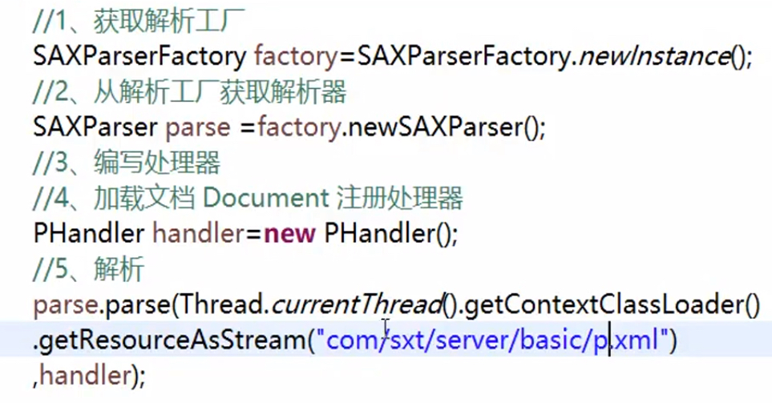

## 原理

<u>客服请求页面，服务器响应内容</u>，响应的内容是根据每个web请求来产生**动态**内容的，其内部即启动多个线程来产生不同内容。

- 基于HTTP协议（应用层的协议）

#### 反射

把Java类中的各种结构（方法、属性、构造器、类名）映射成一个个Java对象

1. 获得Java对象

   class.forName(“包名.类名”)；

2. 动态的创建对象

   get Constructor().newInstance()

   创建构造器

注意这里新建一个对象的话，就是**动态**的，是一个字符串而非一个写死的类

满足松耦合的特点，新建的类可以不存在，后期添加

#### XML解析

extensible markup language，可拓展标记语言

文档**树**

参数配置

四种解析方式：SAX解析 / DOM解析

- SAX解析

  1. 获取解析工厂（SAXParserFactoryFactory）

  2. 从解析工厂获取解析器

  3. 自己编写处理器

     SAX有一个DefaultHander可以extend

  4. 加载处理器

